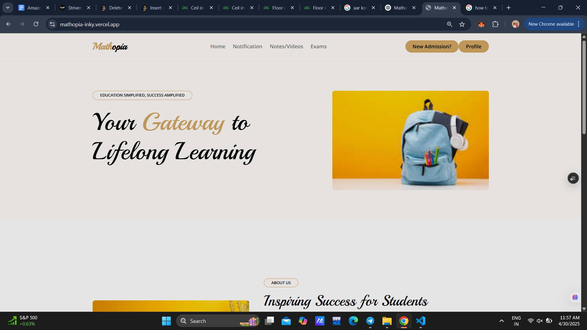
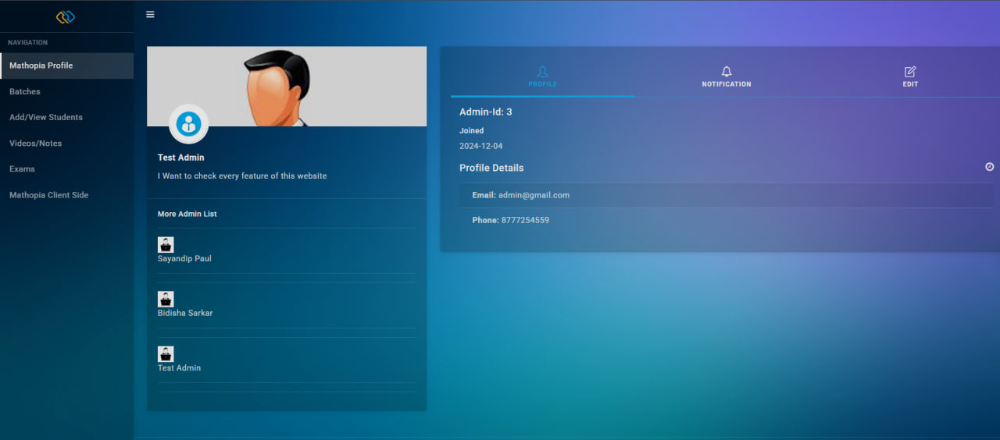
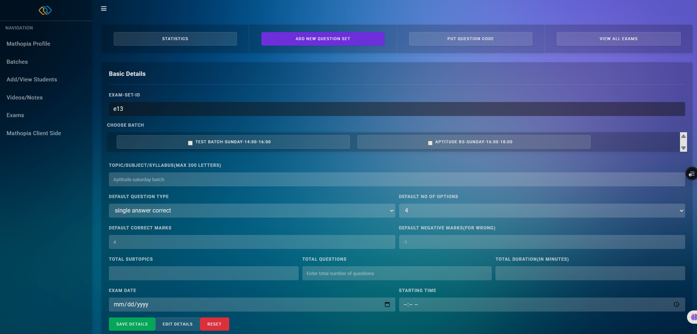
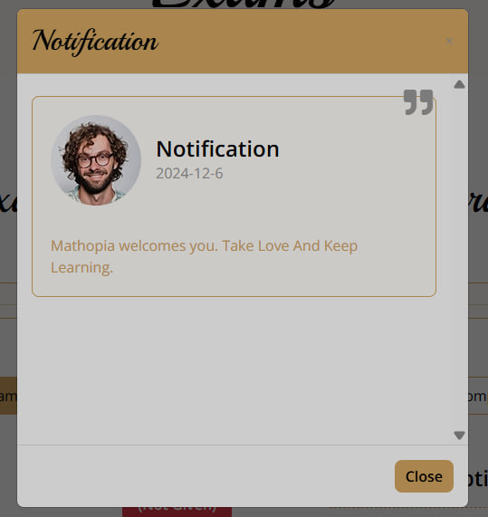
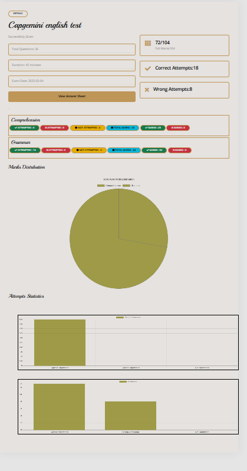

# 📚 Mathopia – Smart Education Platform for Institutions

**Mathopia** is a modern, full-stack education platform built for Mathopia Institution. It supports content delivery, MCQ exams, real-time interactions, performance analytics, and is ready for AI integration. Designed with both **Admin** and **Student** panels, it streamlines learning and management digitally.

🔗 **Live Link**: [https://mathopia-inky.vercel.app](https://mathopia-inky.vercel.app)

---

## 🚀 Features

### 👨‍💼 Admin Panel
- View **Admin Dashboard** and manage **Admin Profile**.
- Approve or manage other admins.
- **Create & manage batches**.
- **Create exams**, set start/finish times, and monitor them live.
- Upload **lecture videos** and **notes** to specific batches (using **Google Drive API**).
- **Approve student registrations** to relevant batches.
- Copy previous question sets and **reuse them** for new exams.
- View list of **exams and batches**.

> 🔐 **Demo Admin Login:**  
> Username: `3`  
> Password: `admin`

---

### 👨‍🎓 Student Panel
- View personal **profile** and **batch assignments**.
- Access **uploaded videos and notes**.
- Take **MCQ-based exams** aligned with the latest board patterns.
- View **exam results graphically** via bar/line charts.
- Receive **real-time notifications** via **Socket.io**.
- Reattempt past exams (previous questions are saved).
- **Apply for admission** directly from the app.

> 🔐 **Demo Student Login:**  
> Student ID: `s-1`  
> Password: `12345`

---

### 📊 Analytics & Visualization
- Real-time data updates using **Socket.io**.
- Visual representation of exam results and performance trends.
- Batch-wise comparison and insights for targeted improvement.

---

### 🤖 Coming Soon: AI Chatbot (LLM)
- Use an **LLM-powered chatbot** to:
  - Quickly find notes or videos.
  - Get summaries of previous exam performance.
  - Answer student queries and assist with navigation.

---

## 🛠 Tech Stack

| Layer | Tech |
|-------|------|
| **Frontend** | Next.js (React Framework) |
| **Backend** | Node.js + Express |
| **Database** | MongoDB |
| **Storage** | Google Drive API |
| **Real-time** | Socket.io |
| **Charts** | Chart.js |
| **AI (Coming)** | LLM integration (OpenAI or similar) |

---


## Installation  

### Prerequisites  
- Node.js installed  
- MongoDB running locally or a cloud database connection string  

### Steps  

1. Clone the repository:  
   ```bash
   git clone https://github.com/your-username/learning-management-system.git
   cd learning-management-system
   ```

2. Install dependencies for the frontend and backend:  
   ```bash
   # Install frontend dependencies
   cd frontend
   npm install

   # Install backend dependencies
   cd ../backend
   npm install
   ```

3. Set up environment variables:  
   - Create a `.env` file in the **backend** folder and add the following:  
     ```
     MONGO_URI=<your-mongodb-connection-string>
     PORT=5000
     JWT_SECRET=<your-secret-key>
     ```

4. Start the application:  
   ```bash
   # Start backend
   cd backend
   npm run start

   # Start frontend
   cd ../frontend
   npm run dev
   ```

5. Access the application at `http://localhost:3000`.

---


> ## 🧪 Demo & Preview

📸 **Screenshots**











> 🎥 **Demo Video**  
> _[Insert YouTube Link Here]_  
> *(Thumbnail will be shown automatically)*

---

## 📈 Results & Impact

- 🔺 **38% increase** in student engagement after adoption.
- ✅ Verified, cloud-hosted notes and videos boosted academic performance.
- 📊 Students used graphical results to identify and improve weak areas.
- 🧑‍🏫 Instructors gained broader reach and effective content control.

---

## 📬 Feedback & Contributions

Have suggestions or want to contribute?  
Email us at **[sayandip126@gmail.com]** or create an issue / PR on GitHub.

---

